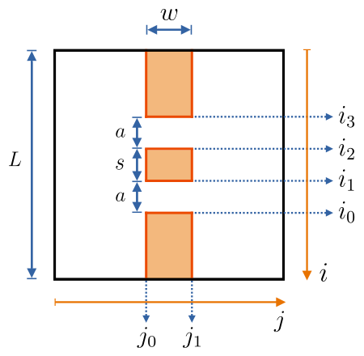

# double-slit-2d-schrodinger

A detailed description of the methods used for these simulations can be found at ["Solving the 2D Schrödinger equation using the Crank-Nicolson method"](https://artmenlope.github.io/solving-the-2d-schrodinger-equation-using-the-crank-nicolson-method/).

## Summary

This repository contains Python 3 scripts for simulating the passage of a 2D Gaussian wave packet through a double slit. For this, the 2D Schrödinger equation is solved using the Crank-Nicolson numerical method.

## The method

To simulate the passage of the 2D Gaussian wavepacket through the double slit, the discretized 2D schrödinger equation is solved at each time step using the Crank-Nicolson numerical method. It is important to note that this method is computationally expensive, but it is more precise and more stable than other low-order time-stepping methods [[1]](#References). It calculates the time derivative with a central finite differences approximation [[1]](#References).

For further information on the Crank-Nicolson method, the mathematical details and the creation of the scripts for the simulations, please remember to check [this blog post](https://artmenlope.github.io/solving-the-2d-schrodinger-equation-using-the-crank-nicolson-method/).

---

For this problem we consider the 2D time-dependent Schrödinger equation:

$$
i\dfrac{\partial \psi(x, y, t)}{\partial t} = - \nabla^2 \psi(x, y, t) + V(x, y, t) \psi(x, y, t)
$$
<!--

-->

which can be expanded as 

$$
i\dfrac{\partial \psi(x, y, t)}{\partial t} = - \left( \dfrac{\partial^2 \psi(x, y, t)}{\partial x^2} + \dfrac{\partial^2 \psi(x, y, t)}{\partial y^2}\right) + V(x, y, t) \psi(x, y, t)
$$
<!--

-->

Here, for simplicity we have considered that $\hbar/2m=1$. Then, to solve the problem, we discretize the simulation space and, consequently, the particle's wave function $\psi$ (our Gaussian wavepacket) and the Scrödinger equation.

The chosen initial (unnormalized) Gaussian wavepacket has the form 

$$
\psi(x, y, t=0) = e^{-\frac{1}{2\sigma^2}\left[(x-x_0)^2+(y-y_0)^2\right]}\cdot e^{-ik(x-x_0)}
$$
<!--

-->

and the double slit is parametrized as the following image shows:

## The results

The two main scripts in this repository [doubleSlit_HW_CN.py](doubleSlit_HW_CN.py) and [doubleSlit_FPB_CN.py](doubleSlit_FPB_CN.py) are used to simulate the system in the case of a double slit with infinite potential barrier walls and finite potential barrier walls respectively. The following two animations show how the results look like:

.gif)   [Hard walls double slit](doubleSlit_HW_CN.py) |     [Potential barrier walls double slit](doubleSlit_FPB_CN.py)
| :-------------: | :-------------: |

## References

[1]: Landau, R.H., Páez Mejía, M.J. & Bordeianu, C.C., 2015. _"Heat Flow via Time Stepping"_. In: _"Computational physics: problem solving with Python"_, 3rd ed. Weinheim: Wiley-VCH. 
